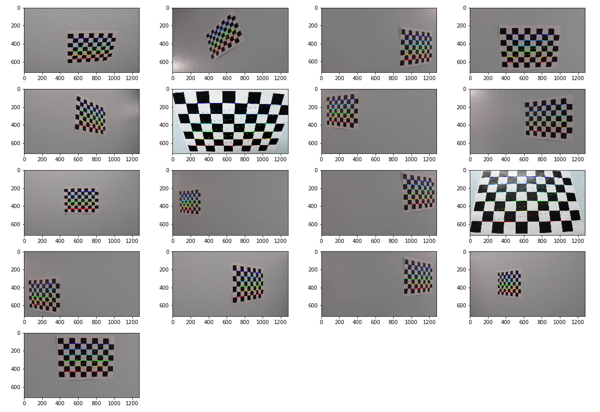
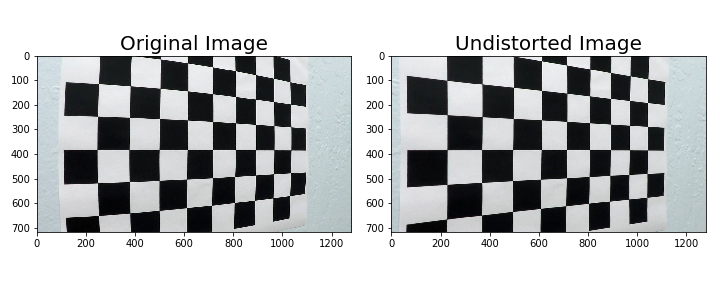
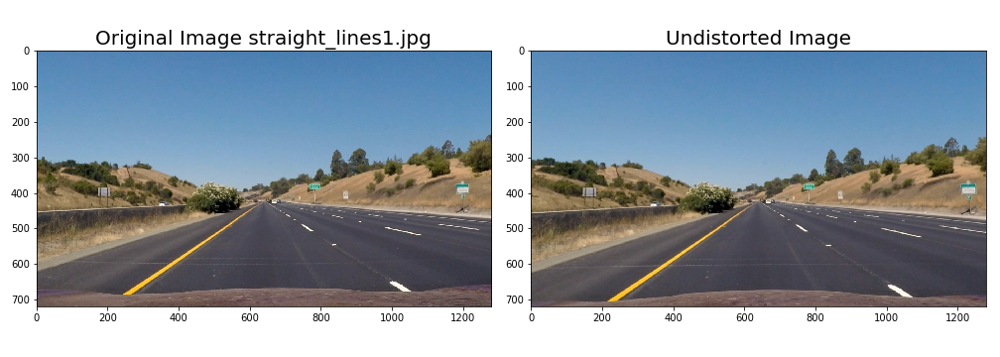
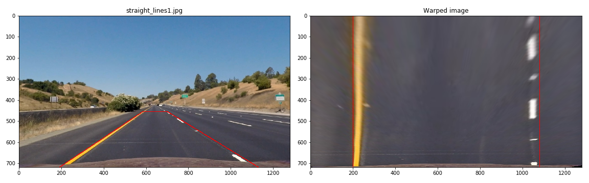
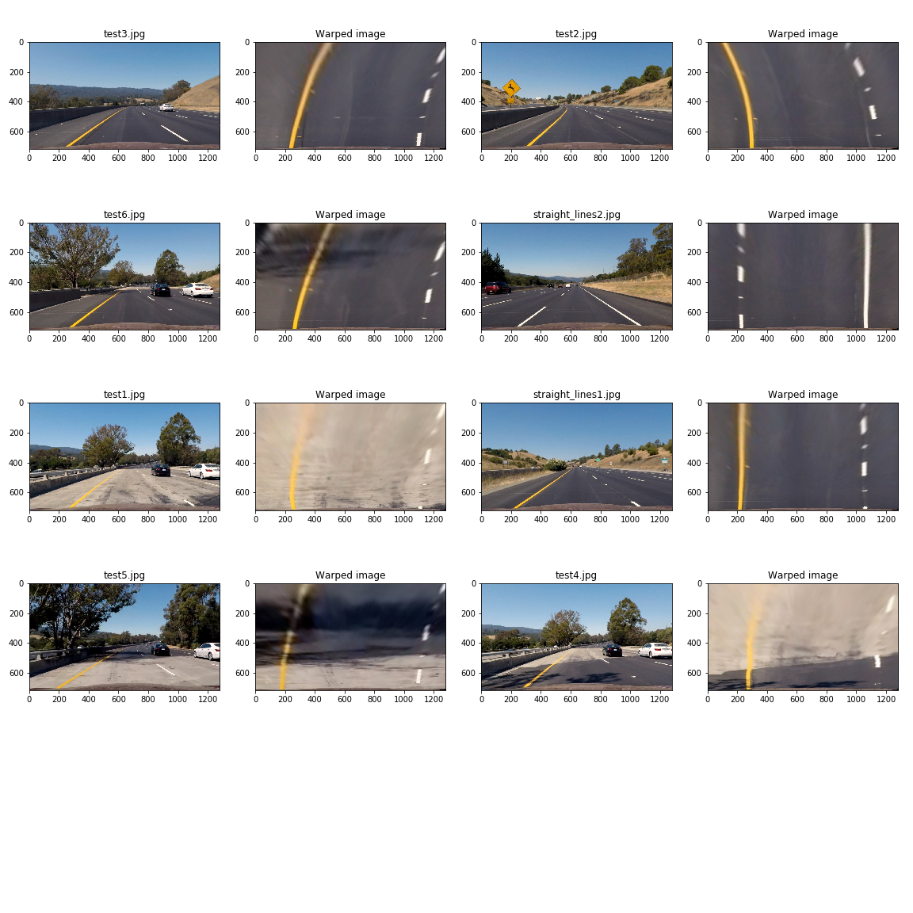
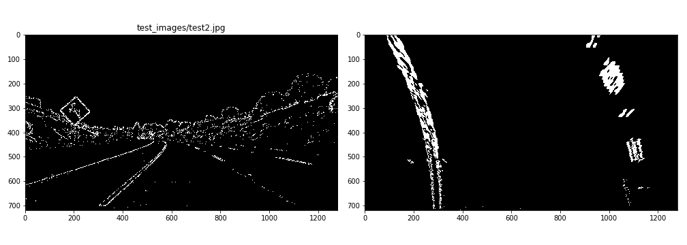
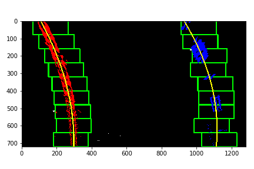
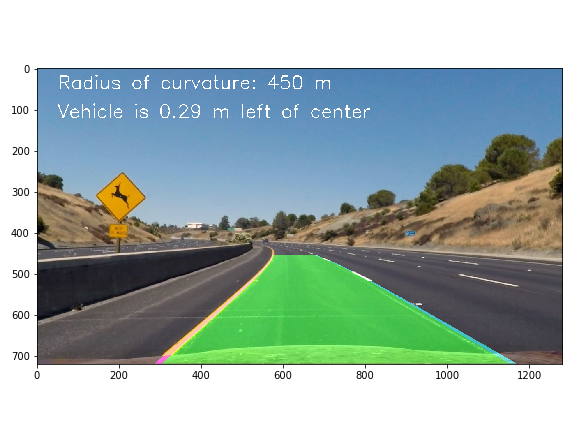
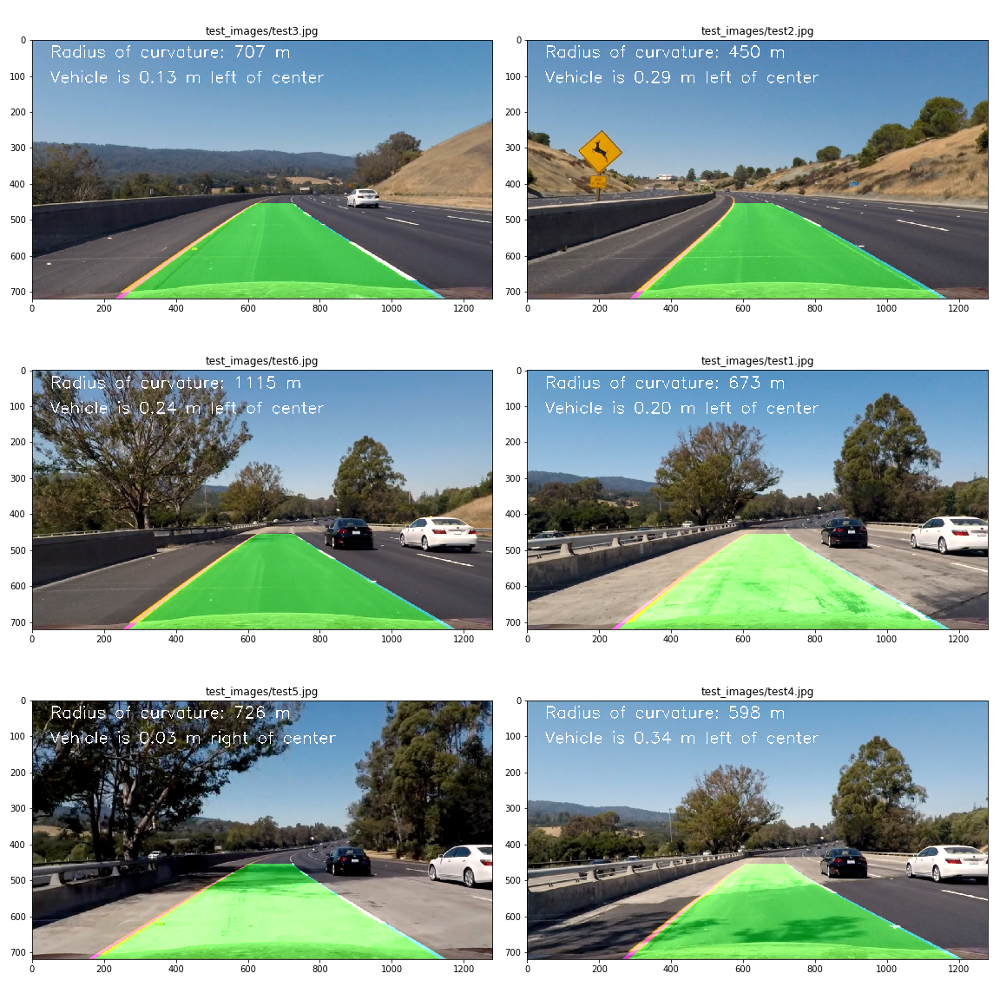

Writeup Template
----------------

**Note**, Some codes are based on the code samples from the Udacity class

**Advanced Lane Finding Project**

The goals / steps of this project are the following:

-   Compute the camera calibration matrix and distortion coefficients given a
    set of chessboard images.

-   Apply a distortion correction to raw images.

-   Use color transforms, gradients, etc., to create a thresholded binary image.

-   Apply a perspective transform to rectify binary image ("birds-eye view").

-   Detect lane pixels and fit to find the lane boundary.

-   Determine the curvature of the lane and vehicle position with respect to
    center.

-   Warp the detected lane boundaries back onto the original image.

-   Output visual display of the lane boundaries and numerical estimation of
    lane curvature and vehicle position.

[Rubric](https://review.udacity.com/#!/rubrics/571/view) Points
---------------------------------------------------------------

### Here I will consider the rubric points individually and describe how I addressed each point in my implementation.

### Writeup / README

#### 1. Provide a Writeup / README that includes all the rubric points and how you addressed each one. You can submit your writeup as markdown or pdf. [Here](https://github.com/udacity/CarND-Advanced-Lane-Lines/blob/master/writeup_template.md) is a template writeup for this project you can use as a guide and a starting point.

You're reading it!

### Camera Calibration

#### 1. Briefly state how you computed the camera matrix and distortion coefficients. Provide an example of a distortion corrected calibration image.

The code for this step is in cell 2 in AdvancedLane.ipynb. I just followed what
was taught in the Udacity class.

I start by preparing "object points", which will be the (x, y, z) coordinates of
the chessboard corners in the world. Here I am assuming the chessboard is fixed
on the (x, y) plane at z=0, such that the object points are the same for each
calibration image. Thus, `objp` is just a replicated array of coordinates, and
`objpoints` will be appended with a copy of it every time I successfully detect
all chessboard corners in a test image. The `objp` is nothing but the true
location of the crossings in the chessboard. In the chessboard we have, it will
be from (0, 0, 0) to (8, 0, 0) in the first row, to from (0, 5, 0) to (8, 5, 0)
in the last row.

`imgpoints` are found by using `cv2.findChessboardCorners` function. `imgpoints`
will be appended with the (x, y) pixel position of each of the corners in the
image plane with each successful chessboard detection. Only if there are 9x6
corners in the image, the chessboard corner detection will be successful.

Here is the plot of the detected chessboard corners from different images:

### Pipeline (single images)

#### 1. Provide an example of a distortion-corrected image.

I then used the output `objpoints` and `imgpoints` to compute the camera
calibration and distortion coefficients using the `cv2.calibrateCamera()`
function. I applied this distortion correction to the test image using the
`cv2.undistort()` function. Codes are here (cell 3 and 4 in AdvancedLane.ipynb).

The same camera calibration and distortion coefficients are used all throught
this project.

To demonstrate this step, here is the undistored chessboard images:

I also show the distortion correction to one of the test images like this one:

#### 2. Describe how (and identify where in your code) you performed a perspective transform and provide an example of a transformed image.

The code for my perspective transform is in cell 5 in AdvancedLane.ipynb. Here
three openCV functions are used, `cv2.getPerspectiveTransform`,
`cv2.getPerspectiveTransform` and `v2.warpPerspective`. Thre first two functions
are to get the transformation matrix and the last one is to apply the tranform
from original image to the bird-view image.

In order to get the tranformation matrix. I need to provide the source (`src`)
and destination (`dst`) points. I chose the hardcode the source and destination
points following the logic that tranforming a section of straight lanes in the
original image to actual straight lines in the warped image.

This resulted in the following source and destination points:

| Source    | Destination |
|-----------|-------------|
| 190, 720  | 200, 720    |
| 585, 455  | 200, 0      |
| 698, 455  | 1260, 0     |
| 1130, 720 | 1260, 720   |

I verified that my perspective transform was working as expected by drawing the
`src` and `dst` points onto a test image and its warped counterpart to verify
that the lines appear parallel in the warped image.

In the warped image, the size of the plotted destination red box is about 3.7x32
meter. This will be useful when calculating the curvature of the detected lanes
in meter.

Here is the perspective transform test on one image:

Here is the perspective transform on all six testing images:

#### 3. Describe how (and identify where in your code) you used color transforms, gradients or other methods to create a thresholded binary image. Provide an example of a binary image result.

My code to do color transforms, gradients calculation and binarization is in
cell 7 and 8 in AdvancedLane.ipynb. I used a combination of color and gradient
thresholds to generate a binary image. Parameters are tuned in order to
highlight the lanes in the binarized image.

The processing steps are: 1. In `preprocess` function. I convert the image into
grayscale, and boost up the sections that were in yellow and white color before.
(**Note**, at first, I just used the S channel in the HLS colorspace, following
the Udacity class instructions. However, later the in the processing pipeline, I
found that the yellow lane could be detected very well, but only part of the
dashed white lane can be extracted. Thus I am using the same method that was
applied in my first CarND project, lane finding, to boost up the sections in
yellow and white color.) 2. Both the horizontal and vertical direction gradients
are calculated, using the `absSobelThresh` function. Within this step, some
gradient threshold chopping was applied. 3. Image is binarized by considering
both the horizontal and vertical direction gradients.

Here's an example of my output for this step. Binarization is done on the
original image after distortion correction. Then the undistored and binarized
image is tranformed using perspective transform.

#### 4. Describe how (and identify where in your code) you identified lane-line pixels and fit their positions with a polynomial?

I was following Udacity class instructions for this part. My Codes are in cell
10 in AdvancedLane.ipynb.

The algorithm is that:

1.  first take a histogram along all the columns in the lower half of the image
    like this. Identify the left peak and right peak as the possible lane
    locations, as the starting point.

2.  Giving a window, centered as the two starting point, get all the
    none-zero-value image pixels. Store all these pixels as lane line pixels.

3.  Moving upward in the image, searching again for the lane line pixels. Here,
    the starting search point will be the middle of the mean location of lane
    line pixels in the previous search.

4.  After gathering all the possible lane line pixels, doing a 2nd order
    polynomial fit to the points. The fitted 2nd order polynomial will be the
    lane line.

Here is the example showing the steps described above:

#### 5. Describe how (and identify where in your code) you calculated the radius of curvature of the lane and the position of the vehicle with respect to center.

My code is in cell 12 in AdvancedLane.ipynb. Again, following the Udaicty class
instructions, once the 2nd order ploynomial line is fitted, the curvature can be
calculated. One additinal step to do is to consider the actual vertical length
and horizontal length per pixel in meters. The position of vehicle with respect
to lane center can also be easily identify by assuming camera image center is
the vehicle center, and comparing with the lane center based on the detected
lane locations.

For the testing image, here is the calculation:

-   Left lane curvature: 495 m

-   Right lane curvature: 404 m

-   Vehicle is 0.29 m left of center

#### 6. Provide an example image of your result plotted back down onto the road such that the lane area is identified clearly.

I implemented this step in cell 14 in AdvancedLane.ipynb. Lane curvature plotted
on the image is the average of the left lane and right lane curvatures.

Here is an example of my result on a test image:

#### 7. Image processing pipeline.

By combining all the processing steps, I created a function for image pipeline,
in cell 16 in AdvancedLane.ipynb.

Here is the code:

~~~~~~~~~~~~~~~~~~~~~~~~~~~~~~~~~~~~~~~~~~~~~~~~~~~~~~~~~~~~~~~~~~~~~~~~~ python
def imagePipeLine(img):
    undistorted = cal_undistort(img, objpoints, imgpoints)
    binary = binarize(undistorted)
    warped_binary = cv2.warpPerspective(binary, M, img.shape[0:2][::-1], flags=cv2.INTER_LINEAR)

    left_fit, left_lane_inds, left_fitx, right_fit, right_lane_inds, right_fitx  = findLane(warped_binary, False)

    leftCurvature, rightCurvature, diffFromVehicle = calc_curv_rad_and_center_dist(warped_binary, left_fit, right_fit, left_lane_inds, right_lane_inds)
    
    imgDrawLane = draw_lane(undistorted, left_fit, right_fit, Minv, leftCurvature, rightCurvature, diffFromVehicle)

    return imgDrawLane
~~~~~~~~~~~~~~~~~~~~~~~~~~~~~~~~~~~~~~~~~~~~~~~~~~~~~~~~~~~~~~~~~~~~~~~~~~~~~~~~

Here is the application to all six testing images:

### Pipeline (video)

#### 1. Provide a link to your final video output. Your pipeline should perform reasonably well on the entire project video (wobbly lines are ok but no catastrophic failures that would cause the car to drive off the road!).

My video processing pipeline (cell 18 in AdvancedLane.ipynb) is very similar to
the image pipeline. The only difference is that I used a `Lane` class to store
lane detection information for the previous n image frames (cell 18 in
AdvancedLane.ipynb). The purpose of having this class are:

1.  Lane information plotted in video image is the average of lane curvature and fitted polynomial from the most recent 5 video frames. This is to make a
    smoother detection.

2.  If lane detection and curvature calculation go wild for one video frame,
    e.g. left lane curvature and right lane curvature difference is over 5 km,
    the detected lane for this frame is discarded. This is to remove some very
    bad lane detection data.

My processed video for `project_video.mp4` is in
`video_output/project_video_output.mp4`. By playing the video, I can see that
the lane was marked correctly. Lane curvature and vehicle location to the lane
center are also calculated reasonably.

**Note**, I also tried the `challenge_video.mp4` and
`harder_challenge_video.mp4`. But my current processing pipeline can not perform
well in these two challenging videos. Maybe I need to tune the paramters for
these two videos, or even adding new image processing algorithms.

### Discussion

#### 1. Briefly discuss any problems / issues you faced in your implementation of this project. Where will your pipeline likely fail? What could you do to make it more robust?

As described previously, at first I only use the S channel in the HLS
colorspace. Then the dashed white lanes can not be detected as well as the
continuous yellow lane. This resulting in bad polynomial fitting. The lane
location is ok in most video frames, but the curvature for the right lane is not
good. After I added the `preprocessing` step in (cell 7 in AdvancedLane.ipynb),
right lane and left lane are detected equally well.

For `project_video.mp4`, the most challenge part is the bridge where road collor
becomes lighter and the shadows on the road. For my current processing
procedure, these situations can be appropriately taken care of.

However, for the other two challenge videos, the shadow effect is more dramatic,
and the brightness of the camera video also changes very frequently. My current
processing pipeline can not draw the lane section correctly for all frames in
these two videos. When I have more time in the future, I will come back and try
to tackle these two challenge videos.
